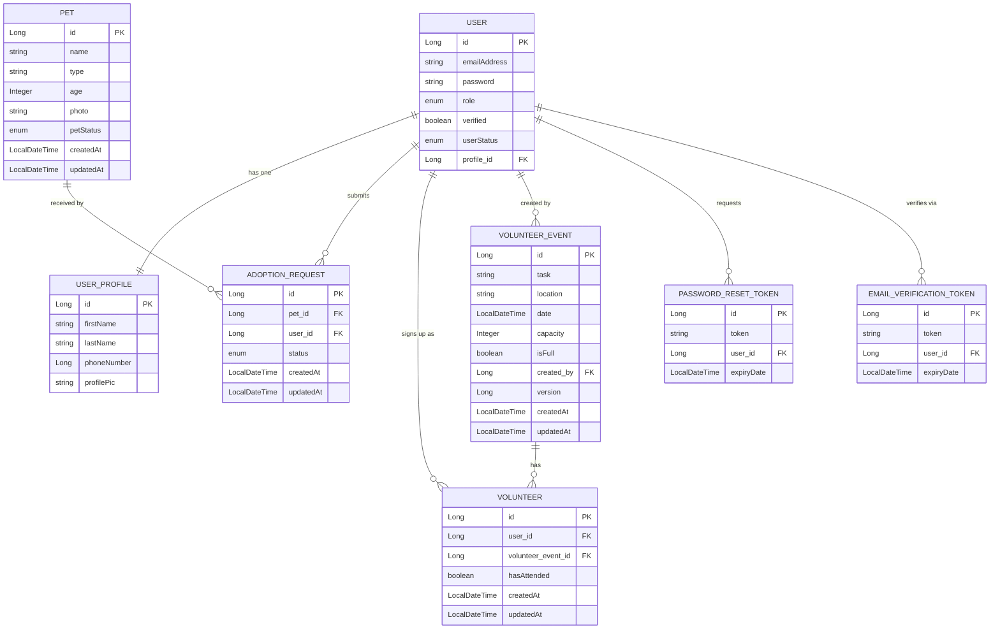

# Pet Adoption Platform

A platform for managing pet adoptions, volunteer events, and user accounts. It connects shelter administrators with prospective adopters and volunteers through a secure, role-based backend system.

---

## 🛠️ Technologies Used

| Layer | Technology |
|---|---|
| Language | Java 17 |
| Framework | Spring Boot 3 |
| Security | Spring Security + JWT (JSON Web Tokens) |
| Database | PostgreSQL |
| ORM | Spring Data JPA / Hibernate |
| Build Tool | Maven |
| Email | JavaMailSender (SMTP) |
| File Handling | Multipart file upload (Base64 image encoding) |
| Concurrency | `ReentrantLock` + JPA `@Version` (Optimistic Locking) |
| Version Control | Git / GitHub |

---

## 📖 General Approach

The application was designed around a **role-based access control (RBAC)** model with two distinct user roles: `ADMIN` and `CUSTOMER`. Every endpoint is protected by Spring Security, with the currently authenticated user resolved from the JWT token on each request. This allowed me to enforce fine-grained permissions at the service layer — for example, only admins can create or delete pets and volunteer events, while customers can only view and request adoption for themselves.

I modelled the domain around five core entities: `User`, `UserProfile`, `Pet`, `AdoptionRequest`, `VolunteerEvent`, and `Volunteer`. Relationships between them (e.g. a user submitting an adoption request for a pet, or signing up to volunteer at an event) are managed through JPA associations with appropriate cascading and fetch strategies. A key design decision was to implement **per-pet locking** using `ReentrantLock` on adoption requests, ensuring that two concurrent users cannot both adopt the same pet — the first request marks the pet as `UNAVAILABLE` before the second can proceed.

The user onboarding flow includes **email verification** before login is permitted, and a **password reset** flow using expiring UUID tokens stored in the database. Both flows send transactional emails via SMTP. Account deactivation was implemented as a soft delete — setting a user's status to `INACTIVE` rather than removing their record — preserving referential integrity across adoption and volunteer data.

---

## 🚧 Unsolved Problems & Hurdles

**Concurrency on adoption requests** was one of the most significant technical challenges. Without locking, a race condition could allow two users to simultaneously adopt the same pet. I solved this using a `ConcurrentHashMap` of `ReentrantLock` objects keyed by pet ID, ensuring that only one thread at a time can check availability and mark a pet as taken. For volunteer event capacity, I used JPA's `@Version` annotation to apply optimistic locking, throwing an `OptimisticLockException` if two threads attempt to decrement capacity simultaneously.

**Image handling** presented a trade-off: storing pet photos as Base64-encoded strings in the database is simple and avoids the need for a separate file storage service, but it is not ideal at scale. This remains an area for improvement — a future iteration would offload images to an object store such as AWS S3.

---

## 📋 User Stories

### 👤 Authentication & User Accounts

* As a user, I want to verify my email before logging in so that my account is secure and valid.
* As a user, I want to log in with my email and password so that I can access my dashboard.
* As a user, I want to reset my password using an email link so that I can regain access if I forget it.
* As a user, I want to deactivate my account so that I can stop using the platform while preserving my data.
* As a user, I want to update my profile details and profile picture so that my account information stays current.

### 🐾 Pet Browsing & Management

* As a customer, I want to browse available pets so that I can see pets ready for adoption.
* As a customer, I want to view pet details including image, age, and type so that I can make an informed adoption decision.
* As an admin, I want to create new pet listings so that pets can be made visible for adoption.
* As an admin, I want to update pet information so that listings remain accurate.
* As an admin, I want to delete outdated pet listings so that unavailable pets are removed.

### 🏠 Adoption Requests

* As a customer, I want to submit an adoption request for a pet so that I can begin the adoption process.
* As a customer, I want to see the status of my adoption request so that I know whether it is pending, approved, or rejected.
* As an admin, I want to review incoming adoption requests so that I can decide who should adopt each pet.
* As an admin, I want to approve an adoption request so that the pet becomes unavailable to others.
* As an admin, I want to reject unsuitable adoption requests so that pets are matched responsibly.

### 🙋 Volunteer Events

* As a customer, I want to browse volunteer events so that I can help shelters and animals.
* As a customer, I want to sign up for a volunteer event so that I can participate.
* As an admin, I want to create volunteer events so that opportunities are available to users.
* As an admin, I want to edit volunteer event details such as date, task, and capacity so that events stay accurate.
* As an admin, I want to mark an event as full once capacity is reached so that no extra volunteers can join.
* As an admin, I want to take the attendance of the volunteers in each volunteer event for record keeping.

### 📊 Administration & Platform Operations

* As an admin, I want to view all registered users so that I can manage the platform.
* As an admin, I want to deactivate user accounts when necessary so that misuse can be controlled.
* As an admin, I want to view adoption and volunteer activity so that I can monitor platform usage.

---

## 🗂️ ERD Diagram




---

## 📅 Planning Documentation

Planning was broken down into GitHub Issues organised by feature area. I started by creating issues for each core model — User, UserProfile, Pet, AdoptionRequest, VolunteerEvent, and Volunteer — covering their entity definitions, repositories, services, and controllers. Once the model-driven issues were in place, I added separate issues for cross-cutting concerns: role management and access control, database seeding, and writing the README.

---

## ⚙️ Installation & Setup

### Prerequisites

- Java 17+
- Maven 3.8+
- PostgreSQL 14+
- An SMTP-capable email account (e.g. Gmail with App Password)

### 1. Clone the Repository

```bash
git clone https://github.com/nadia-husain/GA-JDB-Project3.git
cd GA-JDB-Project3
```

### 2. Configure the Database

Create a PostgreSQL database:

```sql
CREATE DATABASE petadoption;
```

### 3. Set Environment Variables

Create an `application.properties` or `application.yml` in `src/main/resources/` (or set environment variables) with the following:

```properties
# Database
spring.datasource.url=jdbc:postgresql://localhost:5432/petadoption
spring.datasource.username=YOUR_DB_USERNAME
spring.datasource.password=YOUR_DB_PASSWORD
spring.jpa.hibernate.ddl-auto=update

# JWT
jwt.secret=YOUR_JWT_SECRET_KEY
jwt.expiration=86400000

# Email (SMTP)
spring.mail.host=smtp.gmail.com
spring.mail.port=587
spring.mail.username=YOUR_EMAIL@gmail.com
spring.mail.password=YOUR_APP_PASSWORD
spring.mail.properties.mail.smtp.auth=true
spring.mail.properties.mail.smtp.starttls.enable=true
```

### 4. Install Dependencies & Run

```bash
mvn clean install
mvn spring-boot:run
```

The API will start on `http://localhost:8080` by default.

### 5. Upload Directory

The application stores user profile images under `uploads/profilePic/`. Ensure this directory exists and is writable:

```bash
mkdir -p uploads/profilePic
```

